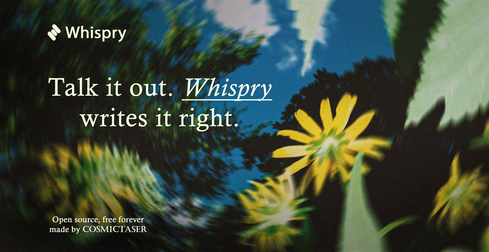
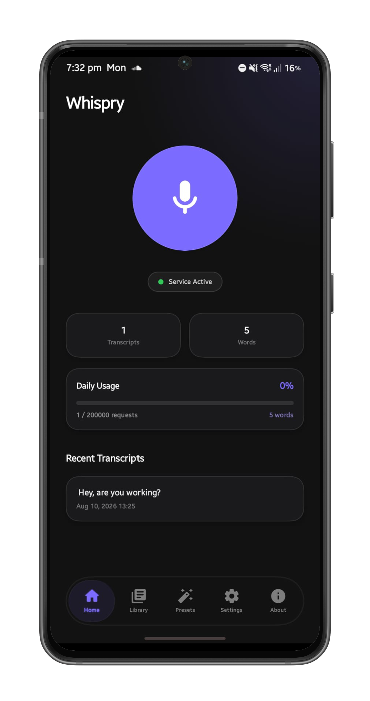
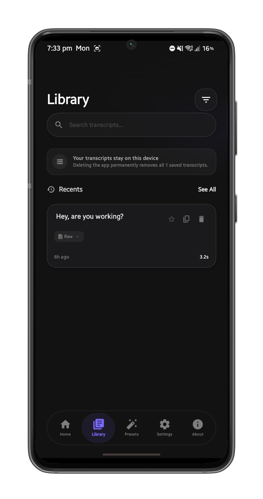
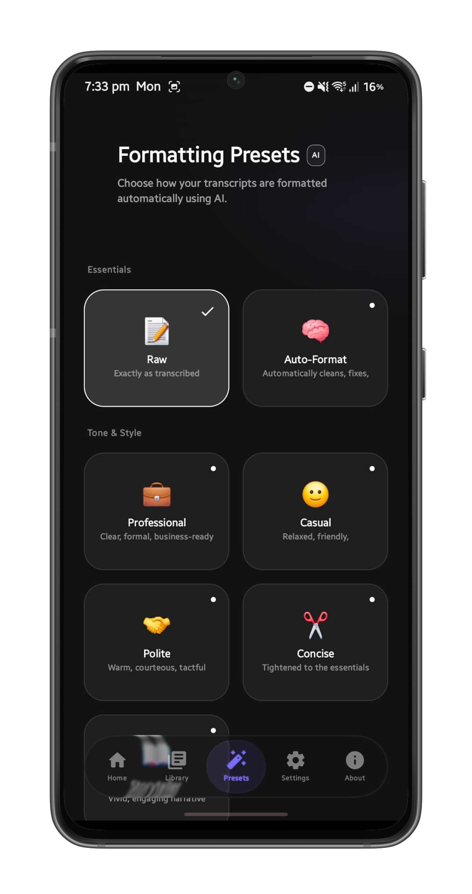
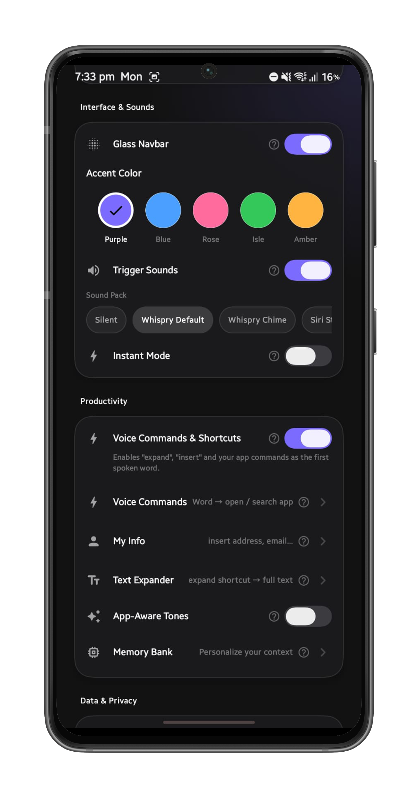
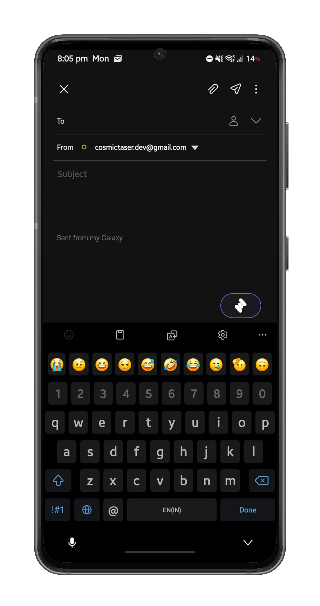
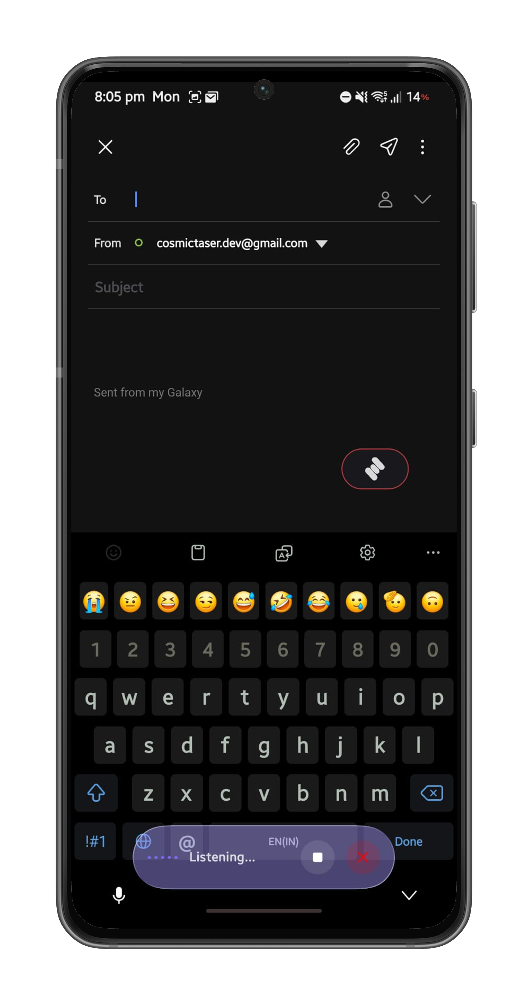

  <h1>Whispry</h1>
  <h3>Whispry is an open-source, hold-to-talk voice transcription app for Android — dictate anywhere, in any app, without switching context.</h3>

  

  

    
    
    
  

<h2>About</h2>

<b>Whispry</b> turns a single trigger — a volume-key press, a floating on-screen switch, or a button riding your keyboard — into an instantly formatted transcript typed straight into whatever app you're in. No copy-paste, no switching apps, no cloud dashboard. It's for anyone who thinks faster than they type: note-taking, messaging, drafting, or just talking instead of thumb-typing.

Built with Kotlin, Jetpack Compose, and a custom Liquid Glass-style design system, Whispry runs entirely on-device except for the actual transcription/formatting call, which goes directly from your device to whichever AI provider you configure — using your own API key.

<h2>✨ Features</h2>

<table align="center" width="100%">
  <tr valign="top">
    <td width="50%">
      <h3>🎙️ Trigger & Capture</h3>
      <ul>
        <li><b>Three trigger surfaces:</b> a volume-key hold (with hands-free and configurable single/double-press modes), a draggable floating widget that snaps to the screen edge, and a button that rides the on-screen keyboard.</li>
        <li><b>Smart trigger suppression</b> and per-app hiding — the widgets stay out of the way in apps where you don't want them.</li>
        <li><b>Configurable widget size, position, arming delay, and idle behavior</b> via a live in-app editor.</li>
      </ul>
    </td>
    <td width="50%">
      <h3>🤖 AI & Language</h3>
      <ul>
        <li><b>Multi-provider AI:</b> transcription and formatting resolve independently — use Groq out of the box, or point either one at any OpenAI-compatible endpoint with your own key.</li>
        <li><b>Hinglish output:</b> romanizes Hindi transcripts instead of leaving them in Devanagari.</li>
        <li><b>App-aware tone:</b> per-app output style presets, so the same dictation reads differently in a chat app vs. an email draft.</li>
        <li><b>11-language UI</b> localization.</li>
      </ul>
    </td>
  </tr>
  <tr valign="top">
    <td width="50%">
      <h3>🛠️ Productivity</h3>
      <ul>
        <li><b>Voice commands:</b> a spoken command router for things like expanding a snippet or inserting a saved value mid-dictation.</li>
        <li><b>Text Expander:</b> short typed triggers that expand into longer snippets.</li>
        <li><b>Memory & My Info:</b> persistent facts the formatting step can draw on, so you don't have to repeat yourself.</li>
        <li><b>Output presets, retention policy, and audio ducking</b> controls.</li>
      </ul>
    </td>
    <td width="50%">
      <h3>🛡️ Privacy & Updates</h3>
      <ul>
        <li><b>On-device trigger and UI:</b> nothing about when/how you trigger a recording leaves your device.</li>
        <li><b>Your key, your provider:</b> audio is sent directly from your device to whichever AI provider you configured, using an API key only you hold — see <a href="#-privacy">Privacy</a> below for specifics.</li>
        <li><b>Built-in OTA updater:</b> checks GitHub Releases in-app, shows the changelog, and installs the signed update in place — no Play Store required.</li>
      </ul>
    </td>
  </tr>
</table>

<h2>📸 Screenshots</h2>

  
  
  
   
  
  
  

<h2>📥 Installation</h2>

1. Download the latest APK from the [Releases page](https://github.com/cosmictaserdev-creator/whispry/releases/latest).
2. On your device, allow installing from this source when prompted (Android will walk you through **Settings → Install unknown apps** the first time).
3. Install and open Whispry, then follow the onboarding flow to grant the accessibility/overlay permissions the trigger you choose needs.

A Play Store listing isn't live yet — GitHub Releases (and the in-app updater below) is the supported distribution channel for now.

<h2>🔄 Updates</h2>

Whispry checks for new versions itself — **Settings → Service & Maintenance → Updates** — against this repo's [GitHub Releases](https://github.com/cosmictaserdev-creator/whispry/releases). When a newer version is out, it shows the release notes and can download + install the signed APK in place, no Play Store or manual download required. Every release is built and signed by the same CI workflow with the same key, so in-app updates always install cleanly over the previous version.

<h2>🏗️ Project structure</h2>

Kotlin + Jetpack Compose, MVI presentation layer, Hilt for DI, Room + DataStore for local data. See [PROJECT_STRUCTURE.md](PROJECT_STRUCTURE.md) for the full package-by-package breakdown.

<h2>🤝 Contributing</h2>

Bug reports, feature requests, and PRs are welcome. See [CONTRIBUTING.md](CONTRIBUTING.md) for build setup, code style, and the PR checklist — and please read the [Code of Conduct](CODE_OF_CONDUCT.md).

<h2>🛡️ Privacy</h2>

<ul>
  <li><strong>No analytics or telemetry:</strong> Whispry doesn't collect or transmit usage data, and there's no backend of its own.</li>
  <li><strong>Local storage:</strong> transcripts, settings, and API keys are stored on-device (Room + DataStore) — nothing is uploaded to a Whispry-run server, because there isn't one.</li>
  <li><strong>Third-party AI providers:</strong> when you trigger a transcription, the recorded audio (and, for formatting, the transcript text) is sent directly from your device to whichever provider you've configured in Settings, using the API key you supplied. That provider's own privacy policy governs what happens to that request — Whispry doesn't proxy, log, or see it.</li>
  <li><strong>Crash logs stay on-device:</strong> if the app crashes, Whispry writes a local stack-trace file to its own app storage (no crash-reporting SDK, no automatic upload). You can attach it from <b>About → Share Crash Log</b> when reporting a bug — it's only ever sent anywhere if you choose to share it yourself.</li>
</ul>

<h2>📜 Disclaimer</h2>

Whispry is an independent, community project and is <strong>not affiliated with, endorsed by, or sponsored by</strong> Groq, OpenAI, or any other AI provider it can be configured to use. Any trademarks referenced belong to their respective owners.

<h2>📄 License</h2>

Whispry is licensed under the <strong>GNU Affero General Public License v3.0</strong>, with an additional Section 7 term requiring attribution to be preserved in any fork or redistribution — see <a href="LICENSE">LICENSE</a> and <a href="NOTICE">NOTICE</a> before you fork this.

<h2>🙏 Credits</h2>

Built and maintained by <a href="https://github.com/cosmictaserdev-creator">cosmictaser</a>.

  <table border="0" cellpadding="15" cellspacing="0" width="85%">
    <tr>
      <td align="center">
        <h3>💬 Support</h3>
        
This is a community project — support is best-effort, not guaranteed response times.

        <ul align="left">
          <li><b>Get help:</b> <a href="https://github.com/cosmictaserdev-creator/whispry/discussions">GitHub Discussions</a></li>
          <li><b>Report a bug:</b> <a href="https://github.com/cosmictaserdev-creator/whispry/issues/new?template=bug_report.yml">open an issue</a> — please <a href="https://github.com/cosmictaserdev-creator/whispry/issues">search existing ones</a> first</li>
          <li><b>Request a feature:</b> <a href="https://github.com/cosmictaserdev-creator/whispry/issues/new?template=feature_request.yml">open an issue</a> or start a <a href="https://github.com/cosmictaserdev-creator/whispry/discussions">Discussion</a></li>
        </ul>
      </td>
    </tr>
  </table>

<!-- TODO: project website / GitHub Pages landing page, once the repo has a bit more traction. -->
